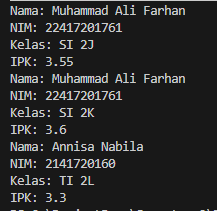
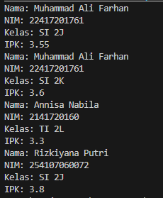

# PASD Jobsheet 2 Object

## 2.1 Percobaan 1: Deklarasi Class, Atribut dan Method

## 2.1.2 Verifikasi Hasil Percobaan


## 2.1.3 Pertanyaan

## 1. Sebutkan dua karakteristik class atau object!

Karakteristik pertama adalah atribut, yaitu data yang dimiliki oleh object dan yang kedua adalah method, yaitu tindakan atau perilaku yang bisa dilakukan object.

---

## 2. Perhatikan class Mahasiswa pada Praktikum 1 tersebut, ada berapa atribut yang dimiliki oleh class Mahasiswa? Sebutkan apa saja atributnya!

Ada 4 atribut, yaitu:
- String nama
- String nim
- String kelas
- double ipk

---

## 3. Ada berapa method yang dimiliki oleh class tersebut? Sebutkan apa saja methodnya!

Ada 4 method, yaitu:
- void tampilkanInformasi()
- void ubahKelas(String kelasBaru)
- void updateIPK(double ipkBaru)
- String nilaiKinerja()

---

## 4. Perhatikan method updateIpk() yang terdapat di dalam class Mahasiswa. Modifikasi isi method tersebut sehingga IPK yang dimasukkan valid yaitu terlebih dahulu dilakukan pengecekan apakah IPK yang dimasukkan di dalam rentang 0.0 sampai dengan 4.0 (0.0 <= IPK <= 4.0). Jika IPK tidak pada rentang tersebut maka dikeluarkan pesan: "IPK tidak valid. Harus antara 0.0 dan 4.0".

Tambahkan:

```java
if (ipkBaru >= 0.0 && ipkBaru <= 4.0) {
    ipk = ipkBaru;
} else {
    System.out.println("IPK tidak valid. Harus antara 0.0 dan 4.0");
}
```
## 5. Jelaskan bagaimana cara kerja method nilaiKinerja() dalam mengevaluasi kinerja mahasiswa, kriteria apa saja yang digunakan untuk menentukan nilai kinerja tersebut, dan apa yang dikembalikan (di-return-kan) oleh method nilaiKinerja() tersebut?

Method nilaiKerja() menentukan kategori kinerja berdasarkan rentang IPK menggunakan struktur if-else if-else, lalu method mengembalikan sebuah String hasil = nilaiKinerja(); berupa kategori kinerja mahasiswa (kinerja sangat baik/baik/cukup/kurang).

## 2.2	Percobaan 2: Instansiasi Object, serta Mengakses Atribut dan Method
## 2.2.2 Verifikasi Hasil Percobaan


## 2.2.3 Pertanyaan
## 1. Pada class MahasiswaMain, tunjukkan baris kode program yang digunakan untuk proses instansiasi! Apa nama object yang dihasilkan?
```java 
Mahasiswa21 mhs1 = new Mahasiswa21();
```
mhs1 adalah nama object yang dihasilkan dari proses instansiasi tersebut.

## 2. Bagaimana cara mengakses atribut dan method dari suatu objek?
Atribut dan method diakses menggunakan operator titik (.) setelah nama object.
``` java
namaObject.namaAtribut
namaObject.namaMethod()
```
## 3. Mengapa hasil output pemanggilan method tampilkanInformasi() pertama dan kedua berbeda?
Karena sebelum pemanggilan tampilkanInformasi() yang kedua, terdapat perubahan data pada object melalui method:
``` java
mhs1.ubahKelas("SI 2K");
mhs1.updateIPK(3.60);
```
Method tersebut mengubah nilai atribut kelas dan ipk, sehingga output pertama menampilkan data awal dan output kedua menampilkan data yang sudah diperbarui.

## 2.3	Percobaan 3: Membuat Konstruktor

## 2.3.2 Verifikasi Hasil Percobaan


## 2.3.3 Pertanyaan

## 1. Pada class Mahasiswa di Percobaan 3, tunjukkan baris kode program yang digunakan untuk mendeklarasikan konstruktor berparameter!
Baris kode yang digunakan untuk mendeklarasikan konstruktor berparameter pada class Mahasiswa21 adalah:
``` java
 public Mahasiswa21(String nama, String nim, double ipk, String kelas) {
        this.nama = nama;
        this.nim = nim;
        this.kelas = kelas;
        this.ipk = ipk;
 }
```
## 2. Perhatikan class MahasiswaMain. Apa sebenarnya yang dilakukan pada baris program berikut? 
baris berikut melakukan proses instansiasi objek menggunakan konstruktor berparameter

## 3. Hapus konstruktor default pada class Mahasiswa, kemudian compile dan run program. Bagaimana hasilnya? Jelaskan mengapa hasilnya demikian!


hasilnya demikian karena konstruktor default sudah dihapus sedangkan didalam class hanya ada konstrutor berparameter (Java tidak otomatis membuat konstruktor default.)

## 4. Setelah melakukan instansiasi object, apakah method di dalam class Mahasiswa harus diakses secara berurutan? Jelaskan alasannya!
Method tidak harus diakses secara berurutan karena method akan dijalankan jika dipanggil dan setiap method berdiri sendiri dan memiliki fungsi masing - masing.

## 5. Buat object baru dengan nama mhs<NamaMahasiswa> menggunakan konstruktor berparameter dari class Mahasiswa!
output hasil
